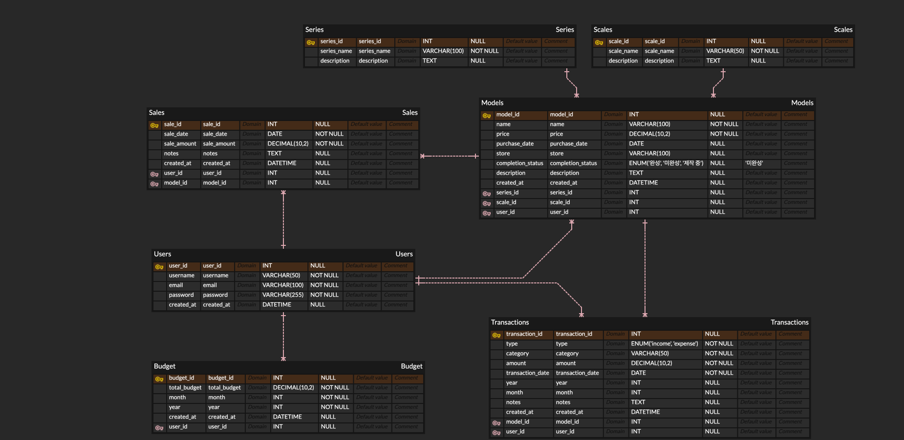

## 2024.12.04
### 1.React프로젝트 github에 업로드
### 2.EC2인스턴스 생성하여 React프로젝트 배포
- EC2 인스턴스 생성
  - OS : Ubuntu 22.04
  - freetier기 때문에 t2.micro로 설정
  - SSH로 접속하기 위해 키페어 생성
  - 보안그룹생성

#### 인바운드 설정
- ssh 접속을 위한 22번 포트
- springboot 접속을 위한 8080번 포트
- http 접속을 위한 80번 포트
- https 접속을 위한 443번 포트

### 3. EC2에 SSH로 접속
- ssh키파일의 권한을 400으로 설정합니다.
```bash
chmod 400 sshKeyFile.pem
```
- EC2에 SSH로 접속한다.
```bash
ssh -i budgetBook.pem ubuntu@ip주소
```
- github 레포지토리에서 ReactProject를 clone한다.
```bash
git clone ~.git
```
- Node Package Manager를 설치한다.
```
sudo apt-get install npm
```
#### 패키지 설치중 에러발생
```bash
sudo apt install npm
Reading package lists... Done
Building dependency tree... Done
Reading state information... Done
E: Unable to locate package npm
```
#### 해결과정
```bash
# 우분투를 처음 설치했으니 apt 패키지를 업데이트했습니다.
ubuntu@ip-172-31-42-97:~$ sudo apt-get update

# 다시 npm install을 진행했으나 실패했습니다.
ubuntu@ip-172-31-42-97:~$ npm install
npm ERR! code ENOENT
npm ERR! syscall open
npm ERR! path /home/ubuntu/package.json
npm ERR! errno -2
npm ERR! enoent ENOENT: no such file or directory, open '/home/ubuntu/package.json'
npm ERR! enoent This is related to npm not being able to find a file.
npm ERR! enoent 

npm ERR! A complete log of this run can be found in:
npm ERR!     /home/ubuntu/.npm/_logs/2024-12-04T06_19_29_740Z-debug-0.log

#파일을 확인하고 프로젝트폴더 안에 package.json이 있으니 이동합니다.
ubuntu@ip-172-31-42-97:~$ ls
budgetBook  package-lock.json

ubuntu@ip-172-31-42-97:~$ cd budgetBook
ubuntu@ip-172-31-42-97:~/budgetBook$ npm install

#node의 현재 버전이 12이고 14이상을 요구합니다.
npm WARN EBADENGINE   required: { node: '^14 || >=16' },
npm WARN EBADENGINE   current: { node: 'v12.22.9', npm: '8.5.1' }
npm WARN EBADENGINE }
...

# node 삭제하기
ubuntu@ip-172-31-42-97:~$ sudo apt-get purge nodejs --auto-remove

# nvm 설치하기
ubuntu@ip-172-31-42-97:~$ curl -o- https://raw.githubusercontent.com/nvm-sh/nvm/v0.39.3/install.sh | bash

# 설정파일 reload를 통해 cli에서 nvm 명령어 사용할 수 있게 설정합니다.
ubuntu@ip-172-31-42-97:~$ source ~/.bashrc

# nvm 버전을 확인합니다.
ubuntu@ip-172-31-42-97:~$ nvm -v
0.39.3

# nvm을 통해 node.js 설치합니다.
# 원하는 버전을 입력하면 해당 버전을 설치할 수 있습니다.
nvm install 20

# nvm 버전 확인 명령어를 통해 패키지 설치 완료 여부를 확인합니다.
nvm -v

# 여러버전이 설치되어있다면 사용할 node.js 버전을 선택합니다.
nvm use 18

# 프로젝트 경로로 이동하여 패키지 설치를 했습니다.
ubuntu@ip-172-31-42-97:~$ cd budgetBook/
ubuntu@ip-172-31-42-97:~/budgetBook$ npm install
```
### 4. 프로젝트 빌드하기
```bash
ubuntu@ip-172-31-42-97:~/budgetBook$ npm run build

The build folder is ready to be deployed.
You may serve it with a static server:

npm install -g serve
serve -s build

# serve 설치하기
ubuntu@ip-172-31-42-97:~/budgetBook$ npm install -g serve

# 빌드한 프로젝트 실행하기
ubuntu@ip-172-31-42-97:~/budgetBook$ serve -s build
```

### 5. 외부에서 접속하기
```bash
http://3.35.124.22:3000
```

#### 터미널을 종료하면 프로그램도 같이 종료가 되는 문제 발생
- Nohup을 사용하여 터미널을 종료하더라도 백그라운드에서 동작하도록 구성
- 리눅스 시스템에서 제공하는 기본 명령어하고 하여 설치를 안해도 된다고 합니다.
```bash
nohup serve -s build &
```
- 실행하고 터미널을 종료하고 외부에서 실행이 잘 되는것을 확인했습니다.

## 2024.12.05
- 집에 미니PC가 있어 AWS가 아닌 미니PC로 환경을 옮겨보고싶어졌습니다.
- 미니PC환경 : Window 10

### 1. React프로젝트 받아오기
- github에서 ReactProject를 다운받아왔습니다.
- serve 패키지를 이용하여 프로젝트를 빌드했습니다.

### 2. Nginx 설치하기
| **기능**               | **AWS CloudFront**                     | **Nginx**                                | **serve**                        |
|-----------------------|---------------------------------------|-----------------------------------------|---------------------------------------|
| **로드 밸런싱**        | ELB로 다중 인스턴스 처리 가능           | 자체 로드 밸런서 설정 가능                 | 지원 안 함                            |
| **캐싱**               | 글로벌 캐싱 제공                       | 로컬 캐싱 제공                            | 지원 안 함                            |
| **리버스 프록시**       | CloudFront가 제한적 제공                | 완벽히 지원                               | 지원 안 함                            |
| **설정 복잡도**         | 중간                                   | 중간-높음                                | 낮음                                  |
| **비용**               | 사용량에 따라 과금                     | 비용 효율적                               | 낮음                                  |

- serve와 Nginx의 차이점을 알아보고 Nginx를 써보기로 했습니다.
#### Nginx 설정하기
```bash
# Nginx 기본 사용자 설정 (Windows에서는 'nobody' 대신 기본값 사용)
#user  nobody;

# Nginx가 사용할 워커 프로세스의 수. 일반적으로 CPU 코어 수와 동일하게 설정.
worker_processes  1;

# 이벤트 모듈 설정
events {
    # 동시에 처리할 수 있는 최대 연결 수 설정 (클라이언트 수와 관계 있음)
    worker_connections  1024;
}

# HTTP 블록: HTTP 요청을 처리하는 설정
http {
    # MIME 타입 정의 파일 포함 (파일 확장자와 콘텐츠 타입을 매핑)
    include       mime.types;

    # 기본 MIME 타입 설정 (파일 확장자를 찾을 수 없을 때 사용)
    default_type  application/octet-stream;

    # 효율적인 파일 전송을 위해 sendfile 활성화
    sendfile        on;

    # 클라이언트 연결 유지 시간 설정 (초 단위, 65초로 설정)
    keepalive_timeout  65;

    # 서버 블록: 실제로 요청을 처리하는 가상 서버 설정
    server {
        # 서버가 수신할 포트를 지정 (80은 기본 HTTP 포트)
        listen       9090;

        # 서버 이름 설정 (요청 헤더의 Host 필드와 매칭)
        server_name  localhost;

        # location 블록: 특정 요청 경로를 처리하는 규칙 설정
        location / {
            # 정적 파일의 루트 디렉토리 경로 설정 (React 프로젝트의 빌드 폴더)
            root   C:/Users/leehj/Desktop/develop/budgetBook/build;

            # 기본 파일로 index.html 제공
            index  index.html;

            # SPA(Single Page Application) 처리를 위한 설정
            # 요청 경로($uri)가 존재하지 않으면 index.html로 처리
            try_files $uri /index.html;
        }

        # 에러 페이지 설정 (500번대 서버 에러 처리)
        error_page   500 502 503 504  /50x.html;

        # 에러 페이지 요청 처리
        location = /50x.html {
            # 에러 페이지의 루트 디렉토리 경로 설정
            root   C:/Users/leehj/Desktop/develop/budgetBook/build;
        }
    }
}
```

### 3. Nginx 실행하기
- 프롬프트에서 nginx폴더로 이동하여 실행하기
```
start nginx
```

### 4. 접속확인
- 로컬에서는 접속이 잘 되는것으로 확인했으나 공인 IP로 접근했을 때 접속이 안되는 현상을 확인했습니다.
- window 방화벽에 포트 인바운드 설정을 하고 실행했는데도 접속이 안됐습니다.

#### 문제해결
- 집으로 인터넷이 들어올 때 모뎀을 거치는데 모뎀쪽에 포트가 열려있지 않으면 접속이 안된다는걸 생각했습니다.
- 모뎀에 접속하여 포트를 열어줬더니 외부에서 접속 성공했습니다.

### 5. 도메인 연결
- 공인IP가 노출되는것이 마음에 안들어서 가비아에서 도메인을 구입한 후 DNS 설정으로 할당을 해줬습니다.
- 도메인을 통해 배포된 프로젝트에 접근할 수 있게 되었습니다.
```
http://hens-lab.shop:10001
```
- 하지만 여전히 도메인 뒤에 포트번호를 붙혀야 합니다.
- ISP에서 80번 포트에 대한 포트포워딩은 막아놓은 상태입니다.

### 6. HTTPS(433번 포트)로 전환
- 443번 포트는 대부분의 통신사에서 차단하지 않는다는걸 검색을 통해 알았습니다.
#### SSL 인증서 발급받기
- Win-acme를 다운로드 받고 프롬프트에서 wacs.exe를 실행합니다.
```bash
N: Create certificate (default settings) #기본 설정을 사용하여 인증서 생성
M: Create certificate (full options) #인증서 생성을 위한 옵션 수동 설정
R: Run renewals (0 currently due) # 인증서 갱신
A: Manage renewals (0 total) # 관리중인 인증서를 보고, 갱신 주기 등 설정
O: More options...
Q: Quit

# Nginx와 같은 다른 웹 서버를 사용하는 이유 2번을 선택한다.
1: Read bindings from IIS # IIS서버에 구성된 도메인을 읽어와 인증서 발급
2: Manual input # 인증서에 포함될 도메인 이름을 수동으로 입력
3: CSR created by another program
C: Abort

#Win-acme에서 인증서를 발급받을 도메인과 인증서의 사용자 지정이름을 확인하는 단계
Description: A host name to get a certificate for. This may be a comma-separated list.
Host: hens-lab.shop

Source generated using plugin Manual: hens-lab.shop
#엔터를 누르면 기본값으로 들어가게 된다.
Friendly name '[Manual] hens-lab.shop'. <Enter> to accept or type desired name:

#하나의 인증서에 여러 도메인을 포함할지, 각 도메인에 대해 개별 인증서를 생성할지 결정
1: Separate certificate for each domain (e.g. *.example.com)
2: Separate certificate for each host (e.g. sub.example.com)
3: Separate certificate for each IIS site
#도메인을 하나 쓸 것이기 때문에 4번 선택
4: Single certificate
C: Abort

# 도메인 소유권을 증명하기 위해 어떤 인증 방식을 사용할 것인지 선택
1: [http] Save verification files on (network) path
2: [http] Serve verification files from memory
3: [http] Upload verification files via FTP(S)
4: [http] Upload verification files via SSH-FTP
5: [http] Upload verification files via WebDav
# 가비아에 도메인을 구입해놨기 때문에  TXT 레코드를 설정하기 위해 6번 선택
6: [dns] Create verification records manually (auto-renew not possible)
7: [dns] Create verification records with acme-dns (https://github.com/joohoi/acme-dns)
8: [dns] Create verification records with your own script
9: [tls-alpn] Answer TLS verification request from win-acme
C: Abort

How would you like prove ownership for the domain(s)?:

# 인증서에 사용할 키 타입을 선택
# 일반적으로 RSA가 안전한 기본값으로 권장된다.
1: Elliptic Curve key
2: RSA key
C: Abort

What kind of private key should be used for the certificate?:


# 인증서를 어디에 저장할 지 설정
1: IIS Central Certificate Store (.pfx per host)
# Nginx는 PEM파일 형식으로 저장하는 것이 적합하다.
2: PEM encoded files (Apache, nginx, etc.)
3: PFX archive
4: Windows Certificate Store (Local Computer)
5: No (additional) store steps

How would you like to store the certificate?:

#PEM파일을 저장할 파일경로 선택하기
#Nginx가 있는 폴더에 ssl폴더를 만들고 저장
Description:         .pem files are exported to this folder.

File path:

# 개인키 파일에 암호를 설정할지 결정하는 과정
# Nginx와 같은 서버에서는 개인 키에 암호를 설정하지 않는 것이 일반적이다.
Description:         Password to set for the private key .pem file.

1: None
2: Type/paste in console
3: Search in vault

Choose from the menu:

# 인증서를 추가로 다른 형식이나 위치에 저장할지 묻는 옵션
# 이미 PEM 형식으로 인증서를 저장한 경우, 대부분의 경우 추가 저장은 필요하지 않다.
1: IIS Central Certificate Store (.pfx per host)
2: PEM encoded files (Apache, nginx, etc.)
3: PFX archive
4: Windows Certificate Store (Local Computer)
5: No (additional) store steps

Would you like to store it in another way too?:


# 발급받은 인증서를 응용 프로그램에 적용하기 위해 추가 작업을 실행할지 결정하는 과정
1: Create or update bindings in IIS
2: Start external script or program
# Nginx 환경에서 발급받은 인증서를 직접 설정파일에 추가해야 하기 때문에 선택
3: No (additional) installation steps

Which installation step should run first?:
```
#### Nginx의 nginx.conf에 환경설정하기
```bash

#user  nobody;
worker_processes  1;

#error_log  logs/error.log;
#error_log  logs/error.log  notice;
#error_log  logs/error.log  info;

#pid        logs/nginx.pid;


events {
    worker_connections  1024;
}


http {
    include       mime.types;
    default_type  application/octet-stream;

    #log_format  main  '$remote_addr - $remote_user [$time_local] "$request" '
    #                  '$status $body_bytes_sent "$http_referer" '
    #                  '"$http_user_agent" "$http_x_forwarded_for"';

    #access_log  logs/access.log  main;

    sendfile        on;
    #tcp_nopush     on;

    #keepalive_timeout  0;
    keepalive_timeout  65;

    #gzip  on;

    #     server {
    #     listen       9090; # 필요시 포트를 8080으로 변경
    #     server_name  localhost;

    #     location / {
    #         root   C:/Users/leehj/Desktop/develop/budgetBook/build;
    #         index  index.html;
    #         try_files $uri /index.html;
    #     }

    #     error_page   500 502 503 504  /50x.html;
    #     location = /50x.html {
    #         root   C:/Users/leehj/Desktop/develop/budgetBook/build;
    #     }
    # }

    server {
        listen 443 ssl;
        server_name "도메인";
        root "빌드파일경로";
        
        # SSL 인증서와 개인 키 경로 설정
        ssl_certificate "경로";
        ssl_certificate_key "경로";

        # SSL 프로토콜 및 암호화 설정
        ssl_protocols TLSv1.2 TLSv1.3;
        ssl_ciphers HIGH:!aNULL:!MD5;

        location / {
            proxy_pass http://localhost:9090; # 백엔드 서버로 요청 전달
            try_files $uri /index.html;       # SPA 라우팅 처리
        }
    }


    # another virtual host using mix of IP-, name-, and port-based configuration
    #
    #server {
    #    listen       8000;
    #    listen       somename:8080;
    #    server_name  somename  alias  another.alias;

    #    location / {
    #        root   html;
    #        index  index.html index.htm;
    #    }
    #}


    # HTTPS server
    #
    #server {
    #    listen       443 ssl;
    #    server_name  localhost;

    #    ssl_certificate      cert.pem;
    #    ssl_certificate_key  cert.key;

    #    ssl_session_cache    shared:SSL:1m;
    #    ssl_session_timeout  5m;

    #    ssl_ciphers  HIGH:!aNULL:!MD5;
    #    ssl_prefer_server_ciphers  on;

    #    location / {
    #        root   html;
    #        index  index.html index.htm;
    #    }
    #}

}
```

## 2024.12.07
### 1. 데이터베이스 설계
- User 테이블
```sql
-- 유저 정보를 저장하는 테이블
CREATE TABLE Users (
    user_id INT AUTO_INCREMENT PRIMARY KEY, -- 유저 고유 ID (자동 증가)
    username VARCHAR(50) NOT NULL,         -- 유저 이름
    email VARCHAR(100) NOT NULL UNIQUE,    -- 이메일 (고유 값, 중복 불가)
    password VARCHAR(255) NOT NULL,        -- 비밀번호 (해싱 필요)
    created_at DATETIME DEFAULT CURRENT_TIMESTAMP -- 계정 생성일
);

```
- Series 테이블
  - 프라모델 시리즈 정보를 관리하는 테이블
```sql
-- 프라모델 시리즈 정보를 저장하는 테이블
CREATE TABLE Series (
    series_id INT AUTO_INCREMENT PRIMARY KEY, -- 시리즈 고유 ID
    series_name VARCHAR(100) NOT NULL,       -- 시리즈 이름
    description TEXT                         -- 시리즈 설명 (선택 사항)
);

```

- Scale 테이블
  - 프라모델 스케일 정보를 관리하는 테이블
```sql
-- 프라모델 스케일 정보를 저장하는 테이블
CREATE TABLE Scales (
    scale_id INT AUTO_INCREMENT PRIMARY KEY, -- 스케일 고유 ID
    scale_name VARCHAR(50) NOT NULL,        -- 스케일 이름 (예: HG, RG 등)
    description TEXT                        -- 스케일 설명 (선택 사항)
);

```

- Model 테이블
  - 프라모델의 기본 정보를 관리하는 테이블
```sql
-- 프라모델 기본 정보를 저장하는 테이블
CREATE TABLE Models (
    model_id INT AUTO_INCREMENT PRIMARY KEY, -- 프라모델 고유 ID
    user_id INT NOT NULL,                   -- 유저 ID (Users 테이블과 연결)
    series_id INT NOT NULL,                 -- 시리즈 ID (Series 테이블과 연결)
    scale_id INT NOT NULL,                  -- 스케일 ID (Scales 테이블과 연결)
    name VARCHAR(100) NOT NULL,             -- 프라모델 이름
    price DECIMAL(10,2) NOT NULL,           -- 프라모델 정가
    purchase_date DATE,                     -- 최초 구매 날짜
    store VARCHAR(100),                     -- 구매처
    completion_status ENUM('완성', '미완성', '제작 중') DEFAULT '미완성', -- 제작 상태
    description TEXT,                       -- 추가 설명 (선택 사항)
    created_at DATETIME DEFAULT CURRENT_TIMESTAMP, -- 기록 생성일
    FOREIGN KEY (user_id) REFERENCES Users(user_id), -- 유저 테이블과 외래 키 연결
    FOREIGN KEY (series_id) REFERENCES Series(series_id), -- 시리즈 테이블과 외래 키 연결
    FOREIGN KEY (scale_id) REFERENCES Scales(scale_id) -- 스케일 테이블과 외래 키 연결
);

```

- Transactions 테이블
  - 가계부 데이터를 관리하는 테이블.
  - 모든 거래(구매, 도구 구매, 판매 등)를 포함
```sql
-- 가계부 데이터를 저장하는 테이블 (구매, 판매, 기타 거래 포함)
CREATE TABLE Transactions (
    transaction_id INT AUTO_INCREMENT PRIMARY KEY, -- 거래 고유 ID
    user_id INT NOT NULL,                         -- 유저 ID (Users 테이블과 연결)
    type ENUM('income', 'expense') NOT NULL,      -- 거래 유형 (수입/지출)
    category VARCHAR(50) NOT NULL,               -- 거래 카테고리 (예: 구매, 도구 구매 등)
    amount DECIMAL(10,2) NOT NULL,               -- 거래 금액
    model_id INT,                                -- 프라모델 ID (Models 테이블과 연결, NULL 가능)
    transaction_date DATE NOT NULL,              -- 거래 날짜
    year INT GENERATED ALWAYS AS (YEAR(transaction_date)) STORED, -- 거래 연도 (자동 생성)
    month INT GENERATED ALWAYS AS (MONTH(transaction_date)) STORED, -- 거래 월 (자동 생성)
    notes TEXT,                                  -- 추가 설명 (선택 사항)
    created_at DATETIME DEFAULT CURRENT_TIMESTAMP, -- 기록 생성일
    FOREIGN KEY (user_id) REFERENCES Users(user_id), -- 유저 테이블과 외래 키 연결
    FOREIGN KEY (model_id) REFERENCES Models(model_id) -- 프라모델 테이블과 외래 키 연결
);

```

- Sales 테이블
  - 프라모델 판매 정보를 관리하는 테이블
```sql
-- 프라모델 판매 정보를 저장하는 테이블
CREATE TABLE Sales (
    sale_id INT AUTO_INCREMENT PRIMARY KEY, -- 판매 고유 ID
    model_id INT NOT NULL,                 -- 프라모델 ID (Models 테이블과 연결)
    user_id INT NOT NULL,                  -- 유저 ID (Users 테이블과 연결)
    sale_date DATE NOT NULL,               -- 판매 날짜
    sale_amount DECIMAL(10,2) NOT NULL,    -- 판매 금액
    notes TEXT,                            -- 추가 설명 (선택 사항)
    created_at DATETIME DEFAULT CURRENT_TIMESTAMP, -- 기록 생성일
    FOREIGN KEY (model_id) REFERENCES Models(model_id), -- 프라모델 테이블과 외래 키 연결
    FOREIGN KEY (user_id) REFERENCES Users(user_id) -- 유저 테이블과 외래 키 연결
);

```
- Budget 테이블
  - 예산 정보를 저장하는 테이블
```sql
CREATE TABLE Budget (
    budget_id INT AUTO_INCREMENT PRIMARY KEY, -- 예산 고유 ID
    user_id INT NOT NULL,                     -- 유저 ID (Users 테이블과 연결)
    total_budget DECIMAL(10,2) NOT NULL,      -- 설정된 총 예산
    month INT NOT NULL,                       -- 예산의 월
    year INT NOT NULL,                        -- 예산의 연도
    created_at DATETIME DEFAULT CURRENT_TIMESTAMP, -- 예산 생성일
    FOREIGN KEY (user_id) REFERENCES Users(user_id) ON DELETE CASCADE -- 유저와 관계
);
```




### 2. 화면 설계
#### User 관련 화면
- 로그인 화면
- 회원가입 화면

#### 가계부 관련 화면
- 대시보드 화면
- 월별 금액 화면